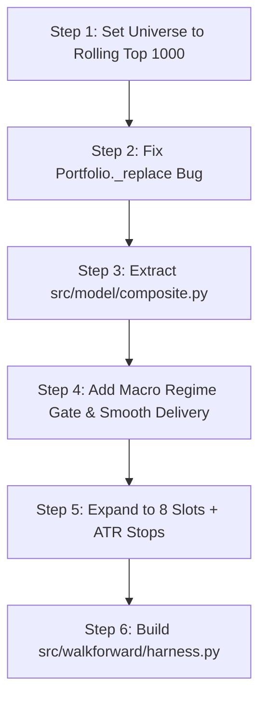

# Fixes & Recommendations for Phases 3–6 — Kailash Nadh Review

This document outlines the architectural fixes, logical corrections, and Indian market reality adjustments for Phases 3 to 6 of [actionplan.md](file:///d:/Code/crazyst/actionplan.md) and [BRD.md](file:///d:/Code/crazyst/BRD.md).

---

## 1. The Universe Question: Top 1000 vs. Top 500 vs. Top 1500

### The Distinction: Rolling As-Of Top 1000 vs. Static 2011 Top 1000

> [!WARNING]
> **Static Top 1000 as of 2011 is a fatal trap (Survivorship Bias in reverse).**
> If you fix a static list of the top 1000 liquid stocks from 2011:
> 1. You permanently exclude 15 years of market leaders and IPOs (e.g., DMart, Indigo, Zomato, Tata Elxsi, Polycab, HAL, BEL).
> 2. You drag dead companies (Kingfisher, DHFL, Reliance Communications, Sintex) into current trading years where they no longer trade.

### Does a Rolling Top 1000 (Evaluated As-Of Date $D$) Make Sense?

**Yes, it is a sound and pragmatic compromise.**

| Metric | Top 1500 (Current) | Top 1000 (Proposed) | Top 500 |
|---|---|---|---|
| **Median Daily Turnover** | ~₹1.0cr – ₹1.9cr at cutoff | ~₹2.5cr – ₹4.0cr at cutoff | ~₹7.0cr – ₹12.0cr at cutoff |
| **Below ₹5cr Turnover** | 30.8% of universe | ~12–15% of universe | ~0% of universe |
| **ADV Gate Refusals** | High (8-month freeze on exits) | Low / Manageable | Negligible |
| **Momentum Breadth** | High, but 73% in illiquid tail | High, covers liquid mid/small | Moderate, large/mid-cap heavy |
| **Circuit Lock / Illiquidity Risk** | Extreme | Moderate | Low |

#### Why Top 1000 works:
- **Cuts the Illiquidity Graveyard (Ranks 1001–1500):** Stocks ranked 1001–1500 typically trade under ₹1.5 crore daily. A single ₹10 Lakh order represents 10–20% of their daily turnover. Trimming the universe to 1000 removes the micro-cap tail that generated the [SOLARINDS 8-month sell freeze](file:///d:/Code/crazyst/docs/brd_decisions_universe.md#L98-L103) while preserving liquid small caps.
- **Maintains Small-Cap Momentum Breadth:** You retain the 201–600 and 601–1000 buckets where momentum signals exhibited strong IC (+0.052 to +0.054 in [E002b](file:///d:/Code/crazyst/LEDGER.md#L673-L676)).
- **Config-Ready:** This requires only a one-line change in [config.yaml](file:///d:/Code/crazyst/config.yaml): `universe.asof_rank_cutoff: 1000`.

---

## 2. Phase 3 Fixes: Features & Signals

### 2.1 Replace 1-Day Delivery % with Smoothed Delivery Turnover
* **The Flaw:** In [src/features/panel.py](file:///d:/Code/crazyst/src/features/panel.py#L14), `delivery_pct` is sampled on the exact decision date. In Indian markets, month-end delivery % is distorted by F&O expiry rollovers (last Thursday), MSCI/FTSE index rebalancing, and promoter/institutional block trades.
* **The Fix:**
  Replace single-day delivery % with a **10-session or 20-session delivery turnover ratio**:
  $$\text{delivery\_ratio\_20d} = \frac{\sum_{t=0}^{19} \text{DELIV\_QTY}_t \times \text{Close}_t}{\sum_{t=0}^{19} \text{Turnover}_t}$$
  This captures sustained institutional accumulation rather than expiry-day synthetic rollover noise.

### 2.2 Re-introduce the Market Regime Filter (The Downtrend Circuit Breaker)
* **The Flaw:** [E002b](file:///d:/Code/crazyst/LEDGER.md#L668-L672) proved that `atr_ratio` flips sign violently: **+0.045 in bull months vs. −0.183 in bear months (94% consistency)**. Momentum without a regime switch gets slaughtered during broad market sell-offs (2011, 2018 mid-cap crisis, 2020 Covid, 2022 rate-hike grind).
* **The Fix:**
  Add a binary or ternary macro regime filter evaluated on the benchmark (Nifty 200 or Nifty 500):
  1. **Bull Regime:** Nifty 200 > 200-day Simple Moving Average (SMA) **AND** 50-day SMA > 200-day SMA. $\rightarrow$ Full momentum allocation (100% invested).
  2. **Bear Regime:** Nifty 200 < 200-day SMA. $\rightarrow$ Halt all new buys; move sold slots into **Cash / Liquid BeES (earning overnight rate)**.
  3. **High Volatility Caution:** If India VIX > 24, reduce position sizing by 50%.

---

## 3. Phase 4 Fixes: Model Architecture & Selection

### 3.1 Extract the Model Out of the Experiments Directory
* **The Flaw:** [src/model/](file:///d:/Code/crazyst/src/model) is empty. Production code in [smoke_e2e.py](file:///d:/Code/crazyst/src/backtest/smoke_e2e.py#L55) imports from `experiments/004b_composite_2feat/run.py` via `importlib`.
* **The Fix:**
  Create a clean, tested module [src/model/composite.py](file:///d:/Code/crazyst/src/model/composite.py):
  ```python
  class CompositeModel:
      def __init__(self, features=("mom_12m_1m", "delivery_ratio_20d"), weights=(0.6, 0.4)):
          self.features = features
          self.weights = weights

      def score(self, df_month):
          # Normalized percentile rank weighting
          ...
  ```

### 3.2 Add Sector & Concentration Constraints
* **The Flaw:** In Indian momentum runs, top-scoring stocks frequently cluster in a single hot thematic sector (e.g., PSUs, defense, railway, sugar, or specialty chemicals). Picking 4 stocks from the same sector creates unhedged sector risk.
* **The Fix:**
  Enforce a **maximum of 2 positions per sector/industry** at any decision date. If the top 4 candidates contain 3 defense stocks, candidate #3 is skipped for the next highest-scoring non-defense name.

---

## 4. Phase 5 Fixes: Engine & Portfolio Rules

### 4.1 Fix the Critical Bug in `Portfolio._replace`
* **The Flaw:** In [src/backtest/portfolio.py:L135-L143](file:///d:/Code/crazyst/src/backtest/portfolio.py#L135-L143):
  ```python
  while None in self.slots:
      candidates = [(f.rank_pct[s], s) for s in f.eligible - held_set
                    if f.rank_pct.get(s) is not None and f.rank_pct[s] <= top_pct]
      if not candidates:
          break
      _, best = min(candidates)
      out.append(Decision("buy", best, "replace", score_bought=f.scores.get(best)))
      held_set.add(best)
  ```
  `self.slots` is never modified inside this loop. The loop runs until `candidates` is exhausted, emitting orders for every stock in the top 15% of the universe.
* **The Fix:**
  Bound the loop by the actual number of empty slots:
  ```python
  empty_count = self.slots.count(None)
  candidates = sorted(
      [(f.rank_pct[s], s) for s in f.eligible - held_set
       if f.rank_pct.get(s) is not None and f.rank_pct[s] <= top_pct]
  )
  for _, best in candidates[:empty_count]:
      out.append(Decision("buy", best, "replace", score_bought=f.scores.get(best)))
      held_set.add(best)
  ```

### 4.2 Fix the Upper Circuit Trap at T+1 Open
* **The Flaw:** In [src/backtest/engine.py:L153](file:///d:/Code/crazyst/src/backtest/engine.py#L153), a bar is considered locked only if `open == high == low == close`. On the NSE, strong breakout stocks open with a gap-up to the circuit limit (e.g., +5% or +10%), trade a few shares in pre-open, and immediately freeze with 0 sell quantity. Buying at the open is impossible.
* **The Fix:**
  Incorporate upper circuit price bands. If `bar["open"] >= previous_close * 1.049` (or hits the daily price band) and `turnover < 0.1 * ADV`, treat it as an **unfillable upper circuit** (`circuit_lock`). The engine must skip the stock and attempt to fill cash or the next-ranked candidate.

### 4.3 Resolve Decision 3 (ADV Gate on Sells)
* **The Flaw:** Risk-management stops (Trigger B) and monthly review exits were vetoed by `notional > 0.05 * ADV` for 8 straight months in [smoke_e2e.py](file:///d:/Code/crazyst/src/backtest/smoke_e2e.py#L1007-L1018). An exit rule that can be vetoed by illiquidity is not a stop loss.
* **The Fix:**
  Adopt **Escalate & Force Exit (`exit_gate: escalate`, `escalate_after: 2`)** as default:
  - If a sell is refused at day $T$, retry at $T+1$.
  - If refused twice, force exit at market with uncapped impact penalty ($P = \text{Open} \times (1 - \text{Impact})$) and log a `forced_exit` event.
  - Sells must take precedence over the ADV gate. A frozen position is an unmanaged liability.

### 4.4 Replace Rigid 8% Stop Loss with ATR-Based Volatility Stops
* **The Flaw:** Trigger B's flat 8% stop loss causes constant whipsawing in mid/small-caps where daily ATR is 4–6%.
* **The Fix:**
  Use a volatility-scaled trailing stop:
  $$\text{Stop Price} = \text{Max}(\text{Entry Price} - 3 \times \text{ATR}_{14}, \text{Trailing High} - 3.5 \times \text{ATR}_{14})$$
  This adapts to each stock's volatility profile, preventing premature stop-outs in high-beta leaders while protecting against genuine trend collapses.

### 4.5 Expand Slots & Volatility Sizing (4 Slots $\rightarrow$ 8–10 Slots)
* **The Flaw:** 4 equal-weight slots (25% each) exposes the portfolio to fatal single-stock idiosyncratic risk (accounting fraud, promoter pledge blowups, lower circuit cascades).
* **The Fix:**
  - Increase portfolio slots to **8 to 10 stocks** (10% to 12.5% max allocation).
  - Size positions inversely proportional to volatility ($\text{Weight}_i \propto 1 / \text{ATR}_i$), capped at 15% per slot.

### 4.6 Realistic Indian Cost Model
* **The Flaw:** Config uses `cost_per_side_pct: 0.20%`.
* **The Reality:**
  - STT on delivery: 0.1% on buy + 0.1% on sell (0.2% round trip).
  - Stamp duty: 0.015% on buy.
  - Exchange turnover + SEBI fees + GST (18% on fees): ~0.04%.
  - Depository (DP) debit charge: ₹13.50 + GST per sell transaction.
  - Bid-ask spread & market impact: 0.5% – 1.0% in rank 201–1000 stocks.
* **The Fix:**
  Update default backtest configuration in [config.yaml](file:///d:/Code/crazyst/config.yaml):
  ```yaml
  backtest:
    cost_per_side_pct: 0.50 # 1.00% round-trip minimum baseline
    dp_charge_per_exit: 15.93 # ₹13.50 + 18% GST
    fill:
      impact_coef: 0.15
      impact_cap_pct: 2.0
  ```

---

## 5. Phase 6 Fixes: Walk-Forward Harness & Reporting

### 5.1 Build the Modular Walk-Forward Engine (`src/walkforward/`)
* Implement [src/walkforward/harness.py](file:///d:/Code/crazyst/src/walkforward/harness.py) using the proven engine/portfolio components:
  1. 36-month rolling test window.
  2. 1-month purge gap between feature window and trading month (prevents forward label leakage).
  3. Dynamic monthly rebalancing with frozen parameters.

### 5.2 Proper Benchmark Alignment
* **The Flaw:** Comparing a small/mid-cap portfolio against Nifty 50 is an asset-class mismatch.
* **The Fix:**
  Benchmark against:
  1. **Nifty 500 TRI** (Primary broad-market total return benchmark).
  2. **Nifty MidSmallcap 400 TRI** or **Nifty Smallcap 250 TRI** (Asset-class peer group).
  3. **Nifty 50 TRI** (Opportunity-cost benchmark).

---

## 6. Implementation Action Plan



### Action Checklist
1. **[config.yaml](file:///d:/Code/crazyst/config.yaml):**
   - Update `universe.asof_rank_cutoff: 1000`.
   - Update `portfolio.n_slots: 8`.
   - Update `backtest.cost_per_side_pct: 0.50`.
   - Update `backtest.exit_gate.mode: "escalate"`.
2. **[src/backtest/portfolio.py](file:///d:/Code/crazyst/src/backtest/portfolio.py):**
   - Fix candidate generator loop in `_replace`.
   - Add ATR trailing stop in `trigger_b`.
   - Add sector limit check (max 2 per sector).
3. **[src/features/panel.py](file:///d:/Code/crazyst/src/features/panel.py):**
   - Replace 1-day delivery % with 20-session delivery turnover ratio.
   - Add Nifty 200 200-SMA regime indicator.
4. **[src/model/composite.py](file:///d:/Code/crazyst/src/model):**
   - Extract standalone model class and tests.
5. **[src/walkforward/](file:///d:/Code/crazyst/src/walkforward):**
   - Implement `harness.py` and report generation against Nifty 500 TRI and Nifty Smallcap 250 TRI.
